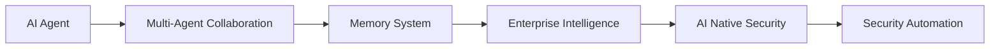

<div align="center">


# Lewis Liu / 刘德凯

### AI 安全工程师 · AI Agent 开发者 · 渗透测试工程师

让 AI 成为安全与智能的生产力。

</div>

---

## 👋 个人简介

我是一名信息安全工程师，长期专注于 **渗透测试、AI Agent、RAG 知识库、MCP 工具链与企业级智能化应用开发**。

我的核心方向是把 AI 与安全工程深度融合：从安全数据采集、漏洞分析、风险识别，到自动化测试、智能报告、企业知识问答，让 AI 不只是“辅助工具”，而是能够参与安全工作流的智能生产力。

```yaml
name: Lewis Liu
chinese_name: 刘德凯
location: 中国 · 上海
role:
  - AI 安全工程师
  - AI Agent 开发者
  - 渗透测试工程师
focus:
  - AI 原生安全
  - AI Agent 系统
  - RAG 知识库
  - 安全自动化
  - 安全情报分析
mission: 让技术创造更安全的未来
```

---

## 🧭 当前关注

| 方向 | 说明 |
| --- | --- |
| 🛡️ AI 原生安全 | 大模型驱动的安全攻防与智能防御 |
| 🤖 AI Agent 系统 | 多智能体协同、自动化决策与工具调用 |
| 📚 RAG 知识库 | 企业知识沉淀、检索增强与智能问答 |
| ⚙️ 安全自动化 | AI 驱动的测试、运维与流程自动化 |
| 📊 安全情报分析 | 数据驱动的威胁研判与风险评估 |

---

## 🚀 重点项目

### 🛡️ PT-AI-Agent

> AI 渗透测试自主框架

基于大模型与 Agent 的渗透测试自动化系统，覆盖信息收集、漏洞分析、利用判断与报告生成，目标是提升安全测试效率与质量。

**核心能力**

- 自动化信息收集与资产梳理
- 漏洞分析、攻击路径推理与风险判断
- 安全报告生成与结果沉淀
- 面向安全场景的 Prompt / Agent Workflow 设计

**技术栈**：`Python` `LLM` `Agent` `安全自动化`

---

### 🧠 AI 深度画像分析系统

> 安全捕获与风险评估平台

基于 LLM 的多源信息分析与结构化建模系统，用于构建企业或个人安全画像，实现风险识别与精准辨别。

**核心能力**

- 多源碎片化信息抽取与融合
- 风险暴露分析与安全画像构建
- 结构化情报生成
- 面向研判场景的知识组织

**技术栈**：`Python` `MongoDB` `LLM` `画像分析`

---

### 🧪 AI2ApiTest → EvoUI

> AI 驱动的智能化测试平台

从单体测试生成演进到多智能体协同的智能化测试平台，支持接口测试、UI 自动化、边界分析与异常场景推理。

**核心能力**

- Multi-Agent 测试生成与协同
- Maker / Analyzer / Checker 架构
- 正向、边界、异常用例生成
- 状态机攻击分析与质量控制
- 专业记忆系统与测试经验沉淀

**技术栈**：`Python` `Flask` `Playwright` `多智能体`

---

### 🏛️ RMS AI Agent

> 企业制度知识库与智能问答助手

基于 RAG + Agent 架构的企业级 AI 助手，提供制度查询、政策解读、流程指引与 MCP 工具集成能力。

**核心能力**

- 企业制度与文档智能问答
- RAG 检索增强与知识库管理
- Agent Router 与 MCP 工具调用
- 文档理解、政策解读与流程辅助

**技术栈**：`RAG` `MCP` `Knowledge Base` `企业应用`

---

### 💻 weixinctrl-GUI

> 本地优先的 AI 桌面助手

面向私有数据与本地模型的桌面 AI 助手平台，强调本地运行、插件扩展与数据可控。

**核心能力**

- PyQt5 桌面端交互
- Ollama 本地模型接入
- 插件化扩展架构
- 私有数据管理与本地化工作流

**技术栈**：`Python` `PyQt5` `Ollama` `Plugin System`

---

## 🧰 技术栈

<table>
<tr>
<td valign="top" width="25%">

### 🛡️ 安全攻防

- Burp Suite
- Nuclei
- Xray
- Nessus
- AWVS
- OWASP ZAP

</td>
<td valign="top" width="25%">

### 🤖 AI 工程

- LLM
- RAG
- LangChain
- MCP
- Agent
- Vector DB

</td>
<td valign="top" width="25%">

### 💻 开发语言

- Python
- Go
- JavaScript
- Flask
- FastAPI
- Playwright

</td>
<td valign="top" width="25%">

### ☁️ 基础设施

- Docker
- Linux
- Git
- MongoDB
- PostgreSQL
- CI/CD

</td>
</tr>
</table>

---

## 🌌 研究与实践路线



我正在持续探索：

- AI Agent 在安全攻防中的稳定落地
- MCP 工具链与企业内部系统集成
- PageIndex / RAG 在企业知识管理中的实践
- 多智能体协同测试与安全自动化
- 大模型时代的安全工程效率提升

---

## 📊 GitHub Status

<div align="center">


<br />


</div>

---

<div align="center">

## >_ 安全不是一成不变的规则，而是与时俱进的对抗；智能不是未来的奢侈品，而是当下的工程实践。

**Build security systems. Build intelligent agents. Build the future with AI.**

</div>
