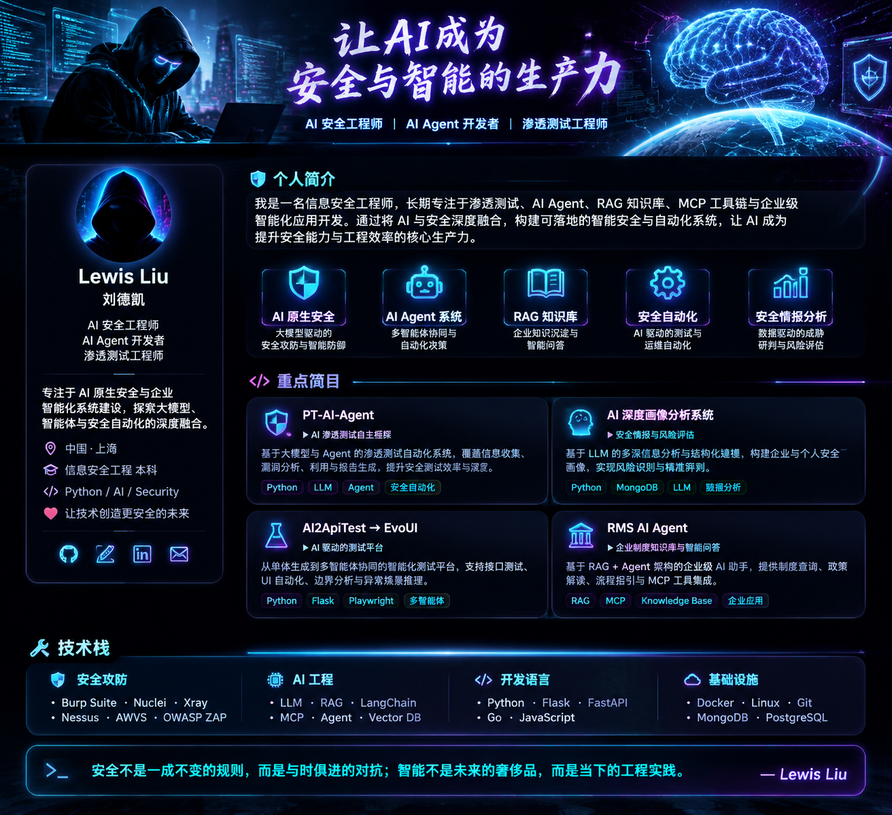
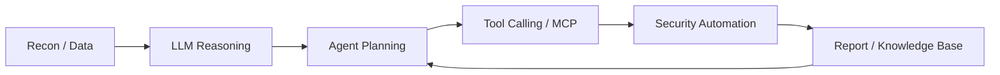

<div align="center">



# 

<p>
  
  
  
  
</p>

```bash
$ whoami
lewisliu@ai-security-lab

$ mission --now
让 AI 成为安全与智能的生产力
```

</div>

---

## ./profile

```yaml
name: Lewis Liu
chinese_name: 刘德凯
location: 中国 · 上海
roles:
  - AI 安全工程师
  - AI Agent 开发者
  - 渗透测试工程师
core_stack:
  - Python / Flask / FastAPI / Playwright
  - LLM / RAG / Agent / MCP / Vector DB
  - Burp Suite / Nuclei / Xray / Nessus / OWASP ZAP
current_focus:
  - AI 原生安全
  - 多智能体安全自动化
  - 企业知识库与智能问答
  - 安全情报分析与风险画像
motto: 安全不是一成不变的规则，而是与时俱进的对抗。
```

> 我是一名信息安全工程师，长期专注于 **渗透测试、AI Agent、RAG 知识库、MCP 工具链与企业级智能化应用开发**。<br>
> 我正在把 AI 引入真实安全工程链路：从资产与信息采集、漏洞分析、风险识别，到自动化测试、报告生成、企业知识问答，让 AI 不只是“辅助工具”，而是可落地、可迭代、可协同的安全生产力。

---

## ./focus_map

| Area | Hacker-style Description | Output |
| --- | --- | --- |
| `AI Native Security` | 大模型驱动的安全攻防、分析与防御增强 | 智能安全工作流 |
| `AI Agent System` | 通过规划、工具调用、记忆与反馈形成闭环 | 自动化决策与执行 |
| `RAG Knowledge Base` | 将企业制度、文档、经验沉淀为可查询知识 | 企业智能问答 |
| `Security Automation` | 把重复测试、巡检、报告流程工程化 | 效率与质量提升 |
| `Cyber Intelligence` | 多源数据融合、画像建模、风险评估 | 安全研判能力 |

---

## ./projects

<table>
<tr>
<td width="50%" valign="top">

### 🛡️ PT-AI-Agent

`AI Penetration Testing Framework`

- 基于大模型 Agent 的渗透测试自动化系统
- 覆盖信息收集、漏洞分析、攻击路径推理与报告生成
- 强调安全测试效率、过程沉淀与可解释输出

**Stack**<br>
`Python` `LLM` `Agent` `Prompt Engineering` `Security Automation`

</td>
<td width="50%" valign="top">

### 🧠 AI 深度画像分析系统

`Security Profiling & Risk Intelligence`

- 面向安全捕获、风险评估与画像分析
- 对碎片化数据进行抽取、关联、融合与结构化建模
- 生成可用于研判的安全画像与风险结论

**Stack**<br>
`Python` `MongoDB` `LLM` `Data Intelligence` `画像分析`

</td>
</tr>
<tr>
<td width="50%" valign="top">

### 🧪 AI2ApiTest → EvoUI

`AI Driven Testing Platform`

- 从单体测试生成演进到多智能体协同测试平台
- 支持接口测试、UI 自动化、边界分析与异常场景推理
- 引入 Maker / Analyzer / Checker 与专业记忆系统

**Stack**<br>
`Python` `Flask` `Playwright` `Multi-Agent` `Testing`

</td>
<td width="50%" valign="top">

### 🏛️ RMS AI Agent

`Enterprise RAG Agent`

- 基于 RAG + Agent 的企业知识助手
- 支持制度查询、政策解读、流程指引与文档理解
- 集成 Agent Router 与 MCP 工具调用能力

**Stack**<br>
`RAG` `MCP` `Knowledge Base` `Vector DB` `Enterprise AI`

</td>
</tr>
<tr>
<td width="50%" valign="top">

### 💻 weixinctrl-GUI

`Local-first AI Desktop Assistant`

- 面向私有数据和本地模型的桌面 AI 助手
- 支持 PyQt5 交互、Ollama 接入与插件化扩展
- 强调本地运行、私有数据管理与可控工作流

**Stack**<br>
`Python` `PyQt5` `Ollama` `Plugin System` `Local AI`

</td>
<td width="50%" valign="top">

### 🧬 Next Lab

`AI Security Engineering`

- 多智能体安全流程编排
- MCP 工具生态与企业内网系统集成
- PageIndex / RAG 在企业知识管理中的实践
- 安全自动化与大模型应用安全探索

**Stack**<br>
`Agent Workflow` `Memory System` `MCP` `RAG` `AI Security`

</td>
</tr>
</table>

---

## ./arsenal

```text
┌─ security ───────────────────────────────────────────────────────────────┐
│ Burp Suite · Nuclei · Xray · Nessus · AWVS · OWASP ZAP                  │
├─ ai_engineering ─────────────────────────────────────────────────────────┤
│ LLM · RAG · LangChain · MCP · Agent · Memory System · Vector Database   │
├─ engineering ────────────────────────────────────────────────────────────┤
│ Python · Go · JavaScript · Flask · FastAPI · Playwright · Docker · Linux │
├─ databases ──────────────────────────────────────────────────────────────┤
│ MongoDB · PostgreSQL · Vector DB                                         │
└──────────────────────────────────────────────────────────────────────────┘
```

---

## ./runtime_path



---

## ./github

> 之前的 `GitHub Status` 外部统计卡片容易因为缓存、接口限制或统计口径导致显示不准确。这里改成更稳定的 GitHub Profile 风格信息区，不再展示可能误导的动态统计数字。

<p align="center">
  <a href="https://github.com/letmego2022?tab=repositories">
    
  </a>
  <a href="https://github.com/letmego2022?tab=stars">
    
  </a>
  <a href="https://github.com/letmego2022?tab=followers">
    
  </a>
</p>

```bash
$ git log --oneline --profile
build(ai-security): agentize security workflows
feat(rag): turn documents into operational knowledge
ops(mcp): connect tools, systems and decisions
research(agent): make automation explainable and controllable
```

---

<div align="center">

### `>_ Build security systems. Build intelligent agents. Build the future with AI.`

**智能不是未来的奢侈品，而是当下的工程实践。**

</div>
